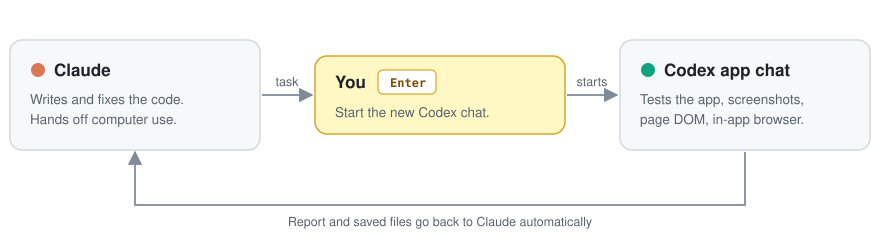

<div align="center">

# codex-relay

**Let Claude hand computer-use work to Codex, and get the result back.**

Claude writes the code. Codex clicks through your running app, takes screenshots and saves page DOM in its fast built-in browser. No copying PRs between agents, and you stay in Claude.

   



</div>

## Why

- **Each agent does what it is best at.** Claude writes better code. Codex has fast computer use and a built-in browser.
- **No manual handoff.** You do not open a PR and paste it into another agent. Claude hands the task over and gets the result back.
- **You can watch.** Codex works in a normal chat in the Codex app.

## How it works

1. You ask Claude for something that needs computer use, for example *"test the new Sign up button at localhost:3000"*.
2. A new chat opens in the Codex app with the task already typed in, and the browser at the page.
3. **You press Enter in that chat.** This is the only thing you do.
4. Codex does the work while you watch.
5. Codex's report and saved files go back to Claude, and Claude continues. For example, it fixes the bug that Codex found.

> [!NOTE]
> **Why the Enter?** It keeps Codex's safety checks on, and it lets Codex use its fast built-in browser, which only works in the Codex app. Claude reminds you before each handoff.

## Examples

Ask Claude in your own words:

```text
Add a Sign up button to the home page, then have Codex test it at localhost:3000 and fix anything it finds.
```

```text
Have Codex go through Timeback, screenshot the leaderboard and save its DOM, then use them in the video.
```

## Install

**Requirements:** macOS, the Codex desktop app, the [Codex CLI](https://github.com/openai/codex) (signed in), and `python3`.

### Option 1: let Claude install it

Paste this into Claude (the desktop app's Code tab, or `claude` in a terminal):

```text
Install the codex-relay plugin for me. Do these steps in order and stop to tell me if one fails:
1. Run `python3 --version`. If python3 is missing, tell me to install it and stop.
2. Run `codex --version`. If it is missing, install it with `npm install -g @openai/codex`
   (or `brew install --cask codex` if npm is missing).
3. Run `codex login status`. If I am not logged in, tell me to run `codex login` myself in a
   terminal, wait for me to say done, then check again.
4. Run `claude plugin marketplace add airman416/codex-relay`
   then `claude plugin install codex-relay@codex-relay`.
5. Run `claude mcp list` and confirm the codex-relay server shows "Connected".
6. Tell me in one line: each handoff opens a new Codex chat that I start with Enter, which keeps
   Codex's safety checks on and lets it use its fast built-in browser.
7. Tell me to start a new session, and give me one example prompt to try codex_computer.
```

### Option 2: install it yourself

```text
/plugin marketplace add airman416/codex-relay
/plugin install codex-relay@codex-relay
```

Then start a new Claude session.

## Reference

The plugin adds one tool, `codex_computer`.

| Input | Required | Description |
|---|---|---|
| `task` | Yes | What Codex must do or check, and what to save. |
| `url` | No | The page to open first, for example `http://localhost:3000`. |
| `dir` | No | Where to save files. Default: a new folder in `~/Documents/Codex/codex-relay/<date>/`. |

It returns Codex's report, the list of saved files, and a link to the Codex chat.

### Settings

Set these as environment variables if you need to change the defaults.

| Variable | Default | Description |
|---|---|---|
| `CODEX_RELAY_START_WAIT` | `300` | Seconds to wait for you to press Enter. |
| `CODEX_STEP_TIMEOUT` | `1200` | Seconds to wait for Codex to finish. |
| `CODEX_RELAY_APP_DIR` | `~/Documents/Codex/codex-relay` | Codex app project where the chats run and files are saved. |

## Good to know

- **One Enter per handoff.** If Claude fixes something and asks Codex to test again, that opens a new chat, so press Enter again.
- **Claude waits while Codex works.** Codex reports once, at the end. It cannot ask Claude questions during the task.
- **Codex permissions stay yours.** If Codex asks for a permission in the Codex app, answer it there.
- **Your chats stay organized.** All handoffs appear under a "codex-relay" project in the Codex app.

## Troubleshooting

| Problem | What to do |
|---|---|
| Claude says the Codex chat did not start | You did not press Enter within 5 minutes. Press Enter in the open Codex chat, then ask Claude to try again. |
| No Codex chat opens | Make sure the Codex desktop app is installed and signed in. |
| `codex_computer` is not available | Run `claude mcp list`. If codex-relay is not "Connected", start a new session or reinstall the plugin. |

## Development

The server is one Python file with no dependencies: [`src/codex_mcp.py`](src/codex_mcp.py). To run the tests:

```bash
python3 tests/test_codex_mcp.py
```
